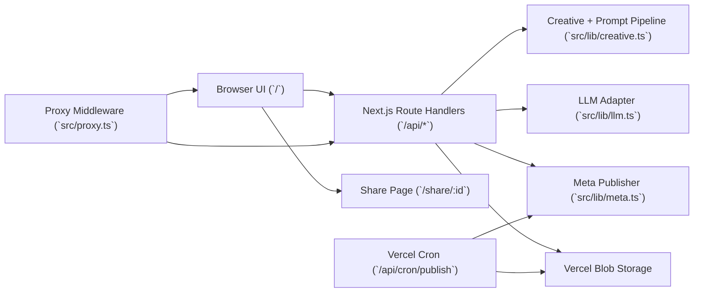

# IG Poster Engine Architecture

## Architecture Goals

- Keep the product usable even when optional integrations are missing.
- Enforce strict input/output contracts for AI and publishing workflows.
- Keep credential handling encrypted and server-side.
- Avoid introducing a database until workload and query patterns require one.

## System Overview

## Runtime and Layers

- App framework: Next.js App Router (Node runtime for server routes that need Node APIs).
- Next.js 16 auth gate entrypoint uses `src/proxy.ts` (Proxy file convention), which is executed as middleware.
- UI layer:
  - `src/app/page.tsx` is the primary editor page, composing a 3-column resizable layout (posts list, editing content, agent activity) using `react-resizable-panels`.
  - Extracted focused components: `post-brief-form.tsx`, `asset-manager.tsx`, `poster-section.tsx`, `strategy-section.tsx`, `publish-section.tsx`, `agent-activity-panel.tsx`.
  - `src/hooks/use-generation.ts` encapsulates SSE-based generation state, including LLM thinking token streaming.
  - `src/lib/agent-types.ts` defines agent run/step types and UI utility functions.
  - `src/app/share/[id]/page.tsx` is read-only project playback.
  - `src/components/poster-preview.tsx` renders and edits overlay layouts.
- API layer:
  - Route handlers in `src/app/api/**/route.ts`.
  - Zod schemas enforce request and response validity.
- Domain layer (`src/lib/*`):
  - creative generation schemas + prompt builders
  - LLM provider abstraction
  - auth/session/token helpers
  - Meta Graph publish/schedule orchestration
  - Blob storage wrappers

## Request and Data Flows

### 1) Generate Creative

1. Client submits brand/post/assets to `POST /api/generate`.
2. Request is validated with `GenerationRequestSchema`.
3. Server resolves LLM auth from connected credential or env fallback.
4. Server optionally extracts website style context (`buildWebsiteStyleContext`).
5. Streaming structured JSON generation runs through provider adapter; LLM thinking/reasoning tokens are forwarded to the client as `llm-thinking` SSE events.
6. Response is validated with `GenerationResponseSchema`.
7. On auth/provider failure, fallback response generator returns deterministic variants.

Why this shape:
- Schema-first contracts reduce malformed LLM output risk.
- Fallback response keeps the core workflow available during outages or unconfigured environments.

### 2) Share Project

1. Client renders selected poster to PNG.
2. `POST /api/projects/save` stores validated payload as `projects/<id>.json` in Blob.
3. App returns share URL `/share/<id>`.
4. Share page loads data via `GET /api/projects/:id`.

Why this shape:
- Blob-backed JSON is enough for immutable share snapshots.
- No relational DB needed for current lookup pattern (`id -> single project`).

### 3) Publish / Schedule

1. Client submits caption + media payload to `POST /api/meta/schedule`.
2. Route resolves auth context (OAuth connection first, env fallback second).
3. If `publishAt` is >2 minutes in the future, route stores a scheduled job in Blob.
4. Otherwise route publishes immediately through Meta Graph API helpers.
5. Cron route (`GET /api/cron/publish`) scans due jobs, resolves auth, publishes, and deletes successful jobs.

Why this shape:
- Separates interactive request latency from scheduled execution.
- Keeps scheduling stateless beyond durable queue records in Blob.

## Authentication and Authorization Model

### Workspace Access Gate

- `src/proxy.ts` (Next.js 16 Proxy entrypoint) enforces login for non-public routes.
- Sessions are signed JWTs in `workspace_session` cookie.
- OAuth flow:
  - start: `/api/auth/google/start`
  - callback: `/api/auth/google/callback`
  - status: `/api/auth/google/status`
  - logout: `/api/auth/google/logout`
- Domain restriction uses `GOOGLE_WORKSPACE_DOMAIN`.

### Instagram Auth

- Preferred path: Meta OAuth (`/api/auth/meta/*`), storing encrypted access token in Blob.
- Fallback path: env credentials (`INSTAGRAM_ACCESS_TOKEN`, `INSTAGRAM_BUSINESS_ID`).
- Runtime resolver returns a uniform `MetaAuthContext` to publishing code.

### LLM Auth

- Preferred path: connected BYOK via `/api/auth/llm/connect`.
- Stored encrypted:
  - Blob-backed record when Blob is enabled.
  - Encrypted cookie payload fallback when Blob is not enabled.
- Fallback path: env credentials (`OPENAI_*` or `ANTHROPIC_*`).

## Storage Model

- Primary persistence: Vercel Blob.
- Typical paths:
  - uploads: `assets/`, `videos/`, `logos/`, `renders/`
  - shared projects: `projects/<id>.json`
  - schedule queue: `schedules/<publishAt>-<id>.json`
  - OAuth/LLM connection records: `auth/...`
- Cookies store lightweight identifiers/tokens, not raw long-lived secrets.

## Security Posture

- Input validation: Zod at route boundaries.
- Secret handling:
  - encryption at rest for OAuth and BYOK credentials
  - explicit secret resolution with production enforcement
- OAuth hardening:
  - state/nonce checks
  - timing-safe state comparison for Meta callback
- Website style extraction hardening:
  - protocol restrictions
  - host/IP safety checks to block private-network SSRF
  - redirect hop limits, timeout, and HTML size caps
- Middleware enforces auth and optional canonical-host redirects.

## Reliability and Failure Handling

- Generation: provider errors degrade to deterministic fallback output.
- Publishing: route returns detailed error context; scheduled failures are reported in cron response.
- Scheduling: successful jobs are deleted; failed jobs remain for retry/inspection.
- Blob-dependent features return clear 503 errors when storage is not configured.

## Deployment and Operations

- CI checks: lint + build.
- Hosting: Vercel deployment + Vercel cron.
- Cron endpoint auth: `Authorization: Bearer <CRON_SECRET>`.
- Canonical host redirect controls:
  - `WORKSPACE_AUTH_PRODUCTION_HOST`
  - `WORKSPACE_AUTH_PREVIEW_HOST`

## Tradeoffs and Future Work

- Blob-as-store is simple and low-overhead, but job querying/analytics are limited at scale.
- Scheduling scans recent blobs; high-volume workloads may need a dedicated queue.
- Share artifacts are immutable snapshots; future requirements may need versioned edits.
- As usage grows, consider introducing:
  - typed persistence layer (SQL + migrations)
  - background workers with dead-letter handling
  - observability around generation/publish success rates
