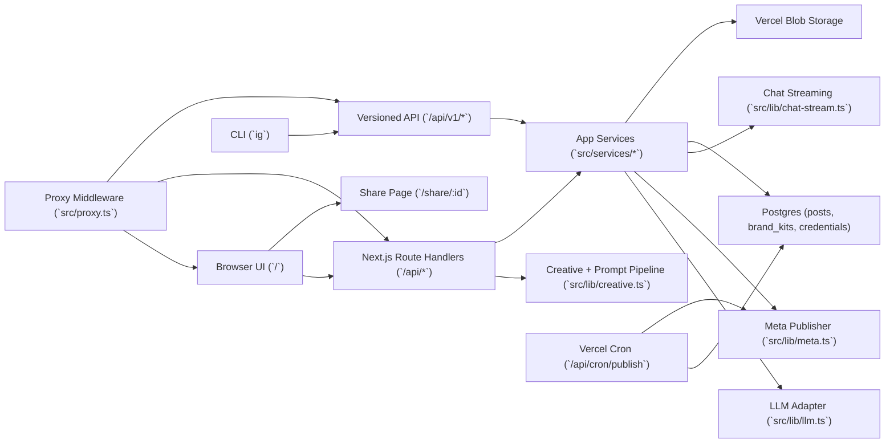

# IG Poster Engine Architecture

## Architecture Goals

- Keep the product usable even when optional integrations are missing.
- Enforce strict input/output contracts for AI and publishing workflows.
- Keep credential handling encrypted and server-side.
- Use Postgres (via Drizzle ORM) for relational app state (posts, brand kits, private credentials, publish jobs) while keeping Blob for binary assets and snapshots.
- Preserve data integrity across auth, generation, and publishing workflows.

## System Overview

## Runtime and Layers

- App framework: Next.js App Router (Node runtime for server routes that need Node APIs).
- Next.js 16 auth gate entrypoint uses `src/proxy.ts` (Proxy file convention), which is executed as middleware.
- UI layer:
  - `src/app/page.tsx` is the primary editor page, composing a 3-column resizable layout (posts list, editing content, agent activity or chat) using `react-resizable-panels`. The right panel has Agent/Chat tab switching.
  - `src/components/app-shell.tsx` hosts nav + main area and can optionally hide the global footer status bar when a route renders its own fixed workflow status bar.
  - Extracted focused components: `post-brief-form.tsx`, `asset-manager.tsx`, `carousel-composer.tsx`, `poster-section.tsx`, `strategy-section.tsx`, `publish-metadata-editor.tsx`, `publish-section.tsx`, `scheduled-planner.tsx`, `agent-activity-panel.tsx`.
  - Settings and brand kit management use controlled full-screen dialog components (`settings-modal.tsx`, `brand-kit-modal.tsx`) mounted from the home route for in-context editing with modal focus management.
  - `src/components/chat/` contains the chat module: `chat-panel.tsx` (embeddable right-panel version), `chat-container.tsx` (full standalone with sidebar), message rendering, markdown, code blocks, and input components.
  - `src/hooks/use-generation.ts` encapsulates SSE-based generation state, including LLM thinking token streaming.
  - `src/hooks/use-chat.ts` manages chat message state, SSE streaming, and conversation operations.
  - `src/lib/agent-types.ts` defines agent run/step types and UI utility functions.
  - `src/app/share/[id]/page.tsx` is read-only project playback.
  - `src/components/poster-preview.tsx` renders persisted overlay layouts for both preview and editor mode, including per-block visibility/text overrides, custom text boxes, carousel slide-aware previewing, adaptive logo-chip contrast, and feed landscape ratio support.
  - `src/components/strategy-section.tsx` exposes the editor inspector for text overrides, custom box CRUD, save-state visibility, and refine/caption controls.
- `src/contexts/post-context.tsx` coordinates post selection, draft auto-save, duplication, and sidebar summary refresh behavior.
- API layer:
  - Route handlers in `src/app/api/**/route.ts`.
  - Versioned CLI-facing handlers in `src/app/api/v1/**/route.ts`.
  - Zod schemas enforce request and response validity.
- Application-service layer:
  - `src/services/actors.ts` resolves an authenticated actor from bearer auth first, then workspace cookies.
  - `src/services/posts.ts` now owns the first extracted transport-neutral post workflows (`list`, `get`, `create`).
- Data layer:
  - `src/db/schema.ts` defines relational post records.
  - `src/db/index.ts` resolves `POSTGRES_URL` with `DATABASE_URL` fallback.
- Domain layer (`src/lib/*`):
  - creative generation schemas + prompt builders
  - LLM provider abstraction
  - auth/session/token helpers
  - Meta Graph publish/schedule orchestration + publish job lifecycle utilities
  - carousel/media-composition utilities
  - Blob storage wrappers

## Request and Data Flows

### 1) Post Workspace (Core App State)

1. Client loads `GET /api/posts` to populate sidebar.
2. Client creates/selects posts through `POST/GET /api/posts*`.
3. Client autosaves edits with `PUT /api/posts/:id` (debounced + beforeunload keepalive).
4. Server persists post state in Postgres.

Why this shape:
- Keeps long-lived drafts out of browser memory and enables multi-post workflow.
- Supports reliable autosave and recent-post retrieval per authenticated workspace user.
- Keeps canvas edits (`overlayLayouts`), carousel media composition (`mediaComposition`), and publish metadata (`publishSettings`) in the same persisted draft object as the creative result, so layout/order/orientation/caption/tagging adjustments survive preview toggles, planner actions, shared snapshots, and post switching.

### 2) Generate Creative

1. Client submits brand/post/assets to `POST /api/generate`.
2. Request is validated with `GenerationRequestSchema`.
3. Server resolves all available LLM connections via `resolveAllLlmAuthFromRequest`, which merges BYOK connections with environment-configured models into a `ResolvedLlmAuthList`.
4. Server optionally extracts website style context (`buildWebsiteStyleContext`).
5. Based on the user's selected `MultiModelMode`:
   - **Fallback**: `generateWithFallback` tries each model in priority order; the first successful response is used.
   - **Parallel**: all models are queried simultaneously, and results are merged and ranked.
   LLM thinking/reasoning tokens are forwarded to the client as `llm-thinking` SSE events.
6. Response is validated with `GenerationResponseSchema`.
7. If all models fail, fallback response generator returns deterministic variants.

Why this shape:
- Schema-first contracts reduce malformed LLM output risk.
- Fallback response keeps the core workflow available during outages or unconfigured environments.

### 3) Share Project

1. Client renders selected poster to PNG.
2. `POST /api/projects/save` stores validated payload as `projects/<id>.json` in Blob.
3. App returns share URL `/share/<id>`.
4. Share page loads data via `GET /api/projects/:id`.

Why this shape:
- Blob-backed JSON is enough for immutable share snapshots.
- Snapshot payload now includes media-composition state plus the active variant asset sequence, so shared carousel previews match the editor order.
- No relational DB needed for current lookup pattern (`id -> single project`).

### 4) Publish / Schedule

Before submitting, clients can call `GET /api/meta/locations?q=<query>` to turn a place name into a Meta `locationId`. Reel clients can also choose whether Meta should `share_to_feed`, and carousel clients store per-item user tags in persisted media composition.

1. Client submits caption + media payload to `POST /api/meta/schedule` (plus optional first comment, optional location metadata, optional user tags, and optional reel `shareToFeed` control).
2. Route runs media preflight checks (public HTTPS URL validation + remote content-type probing).
3. Route resolves auth context (OAuth connection first, env fallback second).
4. If `publishAt` is >2 minutes in the future, route stores a scheduled job in Postgres (`publish_jobs`).
5. Otherwise route publishes immediately through Meta Graph API helpers.
6. If provided, optional first-comment text is posted right after publish (`/{media-id}/comments`) for both immediate and cron-driven publishes. Optional `locationId` is passed through for feed/reel publish jobs, optional top-level `userTags` are passed through for single-image and reel jobs, and carousel image-item tags are passed through per child item. Optional reel `shareToFeed` is passed through for reel-mode publish jobs.
7. Cron route (`GET /api/cron/publish`) first fails stale `processing` jobs for manual review, then claims due queued jobs, enforces the rolling 24-hour Meta publish-window guardrail, resolves auth, publishes, and transitions each job (`published`, deferred back to `queued`, or retry/`failed`).

Why this shape:
- Separates interactive request latency from scheduled execution.
- Keeps scheduling durable and queryable via relational job records.
- Keeps Meta-only lookup logic server-side while the UI stays lightweight for location search, planner controls, and visual tag authoring.

### 4) Chat Conversations

1. Client sends a message to `POST /api/chat` with conversation history and model config.
2. Server streams the response as SSE events (`token`, `done`, `error`, `heartbeat`) using the same LLM auth resolution as generation.
3. Conversation CRUD is handled by `/api/chat/conversations` (list/create) and `/api/chat/conversations/[id]` (get/update/delete).
4. `POST /api/chat/title` auto-generates a short title for new conversations.
5. Conversations are persisted to Blob at `chat/<ownerHash>/conversations/<id>.json` with a summary index at `chat/<ownerHash>/index.json` for fast sidebar listing.

Why this shape:
- Client-sends-history pattern keeps the streaming API stateless and avoids blob read latency on every message.
- Summary index blob prevents N+1 fetches when listing conversations.

## Authentication and Authorization Model

### Workspace Access Gate

- `src/proxy.ts` (Next.js 16 Proxy entrypoint) enforces login for non-public routes.
- Sessions are signed JWTs in `workspace_session` cookie.
- CLI preview requests can also authenticate with `Authorization: Bearer <token>`. Bearer auth is resolved before cookies for `/api/v1/*` consumers.
- OAuth flow:
  - start: `/api/auth/google/start`
  - callback: `/api/auth/google/callback`
  - status: `/api/auth/google/status`
  - logout: `/api/auth/google/logout`
- Domain restriction uses `GOOGLE_WORKSPACE_DOMAIN`.

### Instagram Auth

- Preferred path: Meta OAuth (`/api/auth/meta/*`), storing encrypted access token in the private credential store (DB) with encrypted cookie fallback.
- Fallback path: env credentials (`INSTAGRAM_ACCESS_TOKEN`, `INSTAGRAM_BUSINESS_ID`).
- Runtime resolver returns a uniform `MetaAuthContext` to publishing code.

### LLM Auth (Multi-Model)

- Users can connect multiple BYOK credentials via `/api/auth/llm/connect`, each identified by a unique `connectionId`.
- Model priority order and execution mode (Fallback or Parallel) are saved via `PUT /api/auth/llm/reorder`.
- The disconnect endpoint (`/api/auth/llm/disconnect`) accepts a `connectionId` to remove a specific model.
- The status endpoint (`/api/auth/llm/status`) returns a multi-model response (`LlmMultiAuthStatus`) containing `connections[]`, `mode`, and ordering info.
- Stored encrypted:
  - DB-backed records (via `listCredentialRecords`) when `DATABASE_URL` is configured.
  - Encrypted cookie payload fallback when the database is not available.
- Environment-configured models (`OPENAI_API_KEY`, `ANTHROPIC_API_KEY`) auto-appear in the resolved model list alongside BYOK connections.
- Key types: `MultiModelMode`, `LlmConnectionStatus`, `LlmMultiAuthStatus`, `ResolvedLlmAuthList`.
- Key functions: `resolveAllLlmAuthFromRequest` (merges all sources into a prioritized list), `generateWithFallback` (tries models in order), `listCredentialRecords` (enumerates stored connections).

## Storage Model

- Primary relational persistence: Postgres via Drizzle ORM (`posts`, `brand_kits`, private credentials).
- `posts` table: post drafts, briefs, generation results, publish history, brand kit linkage (`brandKitId`), persisted media composition for carousel order/orientation/crop foundations, and persisted publish settings (`caption`, `firstComment`, `locationId`, `reelShareToFeed`).
  - `brand_kits` table: per-user brand kits with name, brand fields, prompt config, an ordered array of named logos, legacy `logoUrl` compatibility, and default flag.
- Blob persistence: binary media, shared project snapshots, publish outcomes, and chat conversation blobs.
- Typical paths:
  - uploads: `assets/`, `videos/`, `logos/`, `renders/`
  - shared projects: `projects/<id>.json`
  - outcomes: `outcomes/<ownerHash>/<timestamp>-<id>.json`
  - chat conversations: `chat/<ownerHash>/conversations/<id>.json`
  - chat index: `chat/<ownerHash>/index.json`
- Postgres persistence now includes:
  - `publish_jobs` table with job status (`queued`, `processing`, `published`, `failed`, `canceled`), attempts/retries, scheduling timestamp, optional first-comment text, optional image metadata (`location_id`, `user_tags`), and event timeline.
- Cookies store lightweight identifiers/tokens, not raw long-lived secrets.
- `posts.status` is constrained to PostgreSQL enum `post_status` (`draft`, `generated`, `published`, `scheduled`, `archived`).
- CLI-local state is stored outside the app database in a user config file (`~/.config/ig-poster/config.json` unless `IG_POSTER_CONFIG_DIR` is set).

## Security Posture

- Input validation: Zod at route boundaries.
- Secret handling:
  - encryption at rest for OAuth and BYOK credentials
  - explicit secret resolution with production enforcement
- OAuth hardening:
  - state/nonce checks
  - timing-safe state comparison for Meta callback
- Website style extraction hardening:
  - protocol restrictions
  - host/IP safety checks to block private-network SSRF
  - redirect hop limits, timeout, and HTML size caps
- Middleware enforces auth and optional canonical-host redirects.

## Reliability and Failure Handling

- Generation: in Fallback mode, provider errors cascade to the next model in priority order before degrading to deterministic fallback output. In Parallel mode, partial model failures are tolerated as long as at least one model succeeds.
- Publishing: route returns detailed error context; scheduled failures are reported in cron response.
- First-comment posting failures are captured as publish warnings/events and do not roll back successful media publishes.
- Location/user-tag metadata is validated against the publish-media mode across schedule, queue-edit, planner, and publish runtime paths (for example, carousel tags must be per-image item and carousel videos cannot be tagged).
- Location search uses the same Meta auth context as publish requests, so suggestions reflect the connected account/token path.
- Scheduling: cron fails stale `processing` jobs, claims due `publish_jobs`, marks attempts, retries with backoff, and stores terminal outcomes.
- Failed jobs remain queryable in Postgres for inspection/recovery.
- Post workspace APIs require Postgres and return errors when neither `POSTGRES_URL` nor `DATABASE_URL` is configured.
- Blob-dependent features return clear 503 errors when storage is not configured (uploads, share snapshots, outcomes sync).
- Post selection: stale async responses are ignored so rapid switching cannot overwrite the latest selected draft.
- Sidebar refresh: summary reconciliation preserves stable list items to avoid unnecessary list re-renders.
- Draft/save failures are surfaced in the fixed status bar so autosave regressions are visible even when the sidebar is collapsed.

## Deployment and Operations

- CI checks: lint + typecheck + test coverage + build.
- Hosting: Vercel deployment + Vercel cron.
- Cron endpoint auth: `Authorization: Bearer <CRON_SECRET>`.
- Canonical host redirect controls:
  - `WORKSPACE_AUTH_PRODUCTION_HOST`
  - `WORKSPACE_AUTH_PREVIEW_HOST`

## Tradeoffs and Future Work

- Blob-as-store remains simple for media/snapshots, while publish-job querying now lives in Postgres for better operational control.
- As scheduling volume grows, move cron claim logic to dedicated worker processes/queue consumers.
- Share artifacts are immutable snapshots; future requirements may need versioned edits.
- As usage grows, consider introducing:
  - background workers with dead-letter handling
  - observability around generation/publish success rates
