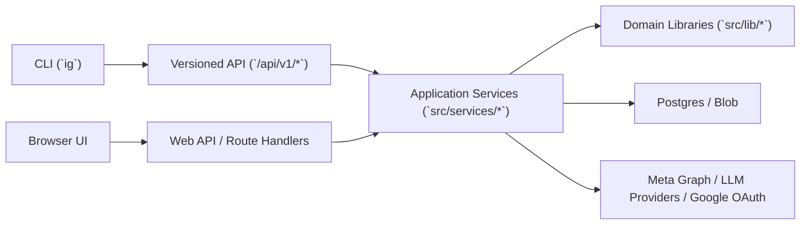

# IG Poster CLI Specification

Date: 2026-03-08
Status: Proposed

## Summary

Add a first-class authenticated CLI for IG Poster that serves two audiences:

- humans who want fast post, asset, generation, and publishing commands
- local agents or scheduled automations that need a stable interface to the IG Poster service/engine

The CLI should be an authenticated client of the IG Poster service, not a second engine with duplicated business logic.

## Why This Exists

The current app is already close to a usable service boundary:

- core creative schemas and prompt logic live in `src/lib/creative.ts`
- Meta publishing primitives live in `src/lib/meta.ts`
- durable publish queue logic lives in `src/lib/publish-jobs.ts`
- persisted post state already exists in Postgres-backed records

That is enough to support a CLI.

What is still missing is a cleaner application layer between transport and domain logic:

- several flows are still orchestrated in `src/app/api/**/route.ts`
- auth resolution is still tied to `Request` and cookies
- API shapes are optimized for the browser app, not a durable CLI contract

The CLI effort should therefore do two things at once:

1. create a useful operator and agent surface
2. force a cleaner engine separation under the existing product

## Goals

- Provide a stable authenticated CLI for local use against a running IG Poster deployment.
- Keep Meta and LLM secrets primarily server-side.
- Support both human-readable output and machine-readable output.
- Make local-agent workflows first-class instead of ad hoc browser automation.
- Preserve the browser UI as the primary rich editor, not replace it.
- Create a reusable service layer that both route handlers and CLI-facing APIs can use.

## Non-Goals

- Do not build a second local database-backed engine inside the CLI.
- Do not bypass Google Workspace access controls.
- Do not move Meta or LLM provider credentials into the CLI by default.
- Do not make the current internal app a public multi-tenant external API in v1.
- Do not depend on Apple Photos integration for the first CLI release.

## Primary Users

### 1. Power user

Wants to quickly:

- list recent posts
- upload assets
- generate concepts
- schedule or publish content
- inspect queue failures

### 2. Local agent

Wants to:

- inspect a local folder or Apple Photos export
- create a draft
- upload selected assets
- call generation
- print a structured proposal for review

### 3. Internal developer

Wants to:

- debug app behavior with a raw API command surface
- run scripted workflows without the browser UI
- validate auth, queue, and generation flows quickly

## SOTA CLI Principles To Adopt

Research basis as of 2026-03-08:

- GitHub CLI (`gh`)
- Google Cloud CLI (`gcloud`)
- Vercel CLI
- Claude Code
- Google Workspace CLI (`gws`)

Recurring patterns worth copying:

### 1. Human-first default, machine-first option

The best CLIs print readable tables and status by default, but support:

- `--json`
- `--jq` or structured filtering
- stable exit codes
- quiet/non-interactive modes

IG Poster should do the same.

### 2. Browser auth plus automation auth

The best CLIs support an easy browser login for humans and a separate path for unattended usage:

- browser/device login for users
- env token or scoped automation token for scripts
- secure OS keychain storage when available

### 3. Profiles and project linking

`gcloud` and Vercel both reduce friction with profiles/configurations and cwd-linked project context.

IG Poster should support:

- named profiles
- a default host/workspace
- optional repo-local project config for default brand kit and output preferences

### 4. Raw API escape hatch

`gh api` and `gcloud` are strong because advanced users can drop below the high-level commands when needed.

IG Poster should ship a raw `api` subcommand from day one.

### 5. Streaming and resumable agent output

Claude Code demonstrates that agent-facing CLIs need:

- structured streaming output
- headless mode
- deterministic permission behavior
- resumable or replayable logs when possible

IG Poster should support streamed generation/chat output and JSON event mode.

### 6. Safe automation controls

Strong CLIs support:

- `--dry-run`
- `--yes`
- explicit scopes
- clear auth status
- low-surprise defaults

That matters for publish actions especially.

## Product Decision

The CLI should be an authenticated remote client of IG Poster.

That means:

- the browser UI and CLI both target the same application services
- the CLI talks to HTTP APIs
- the server remains the authority for workspace auth, Meta auth, LLM auth, queue state, and persistence

This is the right split because it:

- keeps secrets server-side
- supports local agents and remote deployments
- avoids duplicating publish logic
- aligns with the current Next.js architecture instead of fighting it

## Architecture Assessment

### What Is Already Conducive

- Schema-first generation contracts already exist.
- Publishing logic is largely library-based.
- Durable relational state already exists for posts, brand kits, and publish jobs.
- Asset upload already happens through HTTP and public blob URLs.
- Generation already exposes structured SSE progress semantics.

### What Is Not Yet Clean Enough

- Web route handlers still contain use-case orchestration.
- Auth is resolved from cookies and `Request` objects rather than a transport-neutral actor model.
- The current APIs are not versioned as stable client contracts.
- Some responses return raw app-facing payloads instead of CLI-shaped resources.

### Required Architectural Direction

Introduce a distinct application-service layer between route handlers and domain primitives.

Target layering:



## Target Internal Boundaries

### Domain libraries stay where they are

Keep these as low-level primitives:

- creative schemas and prompt builders
- provider adapters
- Meta publish primitives
- Blob helpers
- DB access helpers

### New application services

Add a `src/services/` layer for transport-neutral use cases:

- `src/services/actors.ts`
- `src/services/posts.ts`
- `src/services/assets.ts`
- `src/services/brand-kits.ts`
- `src/services/generation.ts`
- `src/services/publishing.ts`
- `src/services/publish-jobs.ts`
- `src/services/chat.ts`
- `src/services/auth/cli.ts`

These services should accept typed inputs and an authenticated actor, not a `Request`.

### Thin transport adapters

Keep route handlers thin:

- parse request
- resolve actor
- call service
- format HTTP response

The CLI then gets a separate HTTP client layer:

- `src/cli/client.ts`
- `src/cli/auth.ts`
- `src/cli/commands/*`

## Auth Specification

The CLI must have its own auth model.

It should not reuse the browser session cookie directly.

### Why

The current web session is intentionally browser-oriented:

- it is cookie-based
- it is audience-scoped for the web app
- it depends on middleware and browser redirects

That is correct for the app and wrong for a CLI.

### Auth model

Use bearer authentication for CLI/API access, backed by server-issued tokens.

Recommended token model:

- short-lived access token: 15 minutes
- refresh token: 30 days rolling
- optional personal automation token: explicit, scoped, revokable, longer-lived

### Login flow

Primary path:

`ig auth login`

Flow:

1. CLI creates PKCE verifier/challenge and starts a localhost callback listener.
2. CLI opens the browser to the IG Poster auth start endpoint.
3. Browser completes Google Workspace login if needed.
4. Server shows a lightweight consent/confirmation page for the CLI session.
5. Server redirects to the local callback with a short-lived authorization code.
6. CLI exchanges the code for access + refresh tokens.
7. CLI stores the refresh token in the OS keychain and caches the access token in memory.

Fallback path:

`ig auth login --no-browser`

Flow:

1. CLI requests a device/session code.
2. User opens the provided URL manually and enters the code.
3. CLI polls until approved.
4. CLI stores tokens the same way.

### Token storage

Store non-secret profile metadata in:

- `~/.config/ig-poster/profiles.toml`

Store secrets in the OS credential store when available:

- macOS Keychain
- Windows Credential Manager
- Secret Service/libsecret on Linux

Environment override:

- `IG_POSTER_TOKEN` takes precedence over stored credentials

### Recommended profile shape

```toml
[profiles.default]
host = "http://localhost:3000"
email = "user@example.com"
workspace_domain = "example.com"
default = true

[profiles.staging]
host = "https://ig-poster-staging.example.com"
email = "user@example.com"
workspace_domain = "example.com"
```

### Authorization scopes

Scopes should be explicit even for an internal app.

Initial scope set:

- `posts:read`
- `posts:write`
- `assets:write`
- `brand-kits:read`
- `generate:run`
- `publish:write`
- `queue:read`
- `queue:write`
- `chat:run`
- `api:raw`

Default interactive login can request the full user scope set.

Automation tokens should be narrower by default.

### Actor model

Introduce a transport-neutral actor type:

```ts
type Actor = {
  kind: "user" | "automation" | "cron";
  subjectId: string;
  email?: string;
  ownerHash: string;
  scopes: string[];
  authMethod: "cookie" | "bearer" | "token" | "cron";
};
```

All application services should consume `Actor`.

### Token revocation

The server must support:

- logout from current profile
- revoke specific refresh tokens
- revoke automation tokens
- list active CLI sessions/tokens

Recommended commands:

- `ig auth status`
- `ig auth logout`
- `ig auth sessions list`
- `ig auth sessions revoke <id>`

Optional v2:

- `ig auth token create`
- `ig auth token list`
- `ig auth token revoke <id>`

## Config and Linking

### Global profile config

Used for:

- host selection
- current profile
- non-secret preferences

Commands:

- `ig config get`
- `ig config set`
- `ig config list`

### Repo-local project link

Add a repo-local file:

- `.ig-poster/project.json`

Purpose:

- bind the cwd to a host/profile
- set default brand kit
- set default output folder
- optionally pin a workspace or account alias

Suggested shape:

```json
{
  "host": "http://localhost:3000",
  "profile": "default",
  "defaults": {
    "brandKitId": "bk_123",
    "outputDir": ".ig-poster/out",
    "json": false
  }
}
```

Commands:

- `ig link`
- `ig unlink`
- `ig status`

`ig status` should display:

- host
- profile
- auth state
- linked project config
- connected Meta account
- available LLM providers

## CLI Command Surface

Command naming should be short, noun-first, and composable.

Top-level binary:

- `ig`

### Auth

```bash
ig auth login
ig auth login --host http://localhost:3000
ig auth status
ig auth logout
ig auth sessions list
ig auth sessions revoke <session-id>
```

### Config and project linking

```bash
ig status
ig link
ig unlink
ig config list
ig config get host
ig config set host https://ig-poster.example.com
```

### Raw API escape hatch

```bash
ig api GET /api/v1/posts
ig api POST /api/v1/generate --body @request.json
ig api GET /api/v1/publish-jobs --jq '.jobs[] | {id,status}'
```

### Brand kits

```bash
ig brand-kits list
ig brand-kits get <id>
```

### Posts

```bash
ig posts list
ig posts list --status draft
ig posts get <id>
ig posts create --title "Spring Release"
ig posts update <id> --patch @patch.json
ig posts duplicate <id>
ig posts archive <id>
```

### Assets

```bash
ig assets upload ./images/photo-1.jpg
ig assets upload ./clips/reel.mov --folder videos
ig assets upload ./images/*.jpg --json
```

### Generation

```bash
ig generate run --post <id>
ig generate run --request @generate.json
ig generate run --post <id> --stream-json
ig generate refine --post <id> --instruction "Make this more editorial"
```

### Publish

```bash
ig publish now --post <id>
ig publish schedule --post <id> --at "2026-03-10T09:00:00-07:00"
ig publish now --request @publish.json --dry-run
```

### Queue

```bash
ig queue list
ig queue get <job-id>
ig queue cancel <job-id>
ig queue retry <job-id>
ig queue move-to-draft <job-id>
ig queue update <job-id> --patch @queue-patch.json
```

### Chat

```bash
ig chat ask "Give me three stronger hooks for post 18abc"
ig chat ask --post <id> "Rewrite this caption for a product launch"
ig chat ask --stream-json
```

### Photos and local-agent workflows

These are v2 commands, but should shape the architecture now.

```bash
ig photos recent --since 7d --limit 20
ig photos recent --album Favorites --json
ig photos propose --since 7d --brand-kit <id>
```

## Output Specification

### Global flags

Support these global flags consistently:

- `--profile <name>`
- `--host <url>`
- `--json`
- `--stream-json`
- `--jq <expr>`
- `--quiet`
- `--no-color`
- `--yes`
- `--dry-run`
- `--timeout <duration>`

Recommended later:

- `--flags-file <path>`

### Human output mode

Default for interactive use:

- concise status lines
- tables for collections
- color only when stdout is a TTY
- spinners or progress bars only when stdout is a TTY

### JSON output mode

`--json` should emit a single JSON document and nothing else.

Suggested envelope:

```json
{
  "ok": true,
  "data": {}
}
```

For errors:

```json
{
  "ok": false,
  "error": {
    "code": "AUTH_REQUIRED",
    "message": "Login required"
  }
}
```

### Streaming JSON mode

`--stream-json` should emit newline-delimited JSON events.

Suggested event envelope:

```json
{"type":"run-start","runId":"run_123"}
{"type":"step-start","stepId":"resolve-provider","title":"Resolve model provider"}
{"type":"llm-thinking","delta":"Considering carousel hooks"}
{"type":"result","data":{"variants":[]}}
{"type":"done"}
```

The generation and chat commands should reuse the server event model where practical.

### Exit codes

Use stable, documented exit codes:

- `0` success
- `2` invalid usage or validation failure
- `3` authentication failure
- `4` authorization failure
- `5` not found
- `6` conflict or invalid state
- `7` upstream provider failure
- `8` network or transport failure
- `9` partial success with warnings

## API Specification

The CLI should target versioned APIs rather than binding to existing browser-oriented routes.

Recommended namespace:

- `/api/v1/*`

### Auth endpoints

- `POST /api/v1/auth/cli/start`
- `POST /api/v1/auth/cli/exchange`
- `POST /api/v1/auth/cli/poll`
- `POST /api/v1/auth/cli/refresh`
- `POST /api/v1/auth/cli/logout`
- `GET /api/v1/auth/whoami`
- `GET /api/v1/auth/sessions`
- `POST /api/v1/auth/sessions/:id/revoke`

Optional v2:

- `POST /api/v1/auth/tokens`
- `GET /api/v1/auth/tokens`
- `POST /api/v1/auth/tokens/:id/revoke`

### Resource endpoints

- `GET /api/v1/posts`
- `POST /api/v1/posts`
- `GET /api/v1/posts/:id`
- `PATCH /api/v1/posts/:id`
- `POST /api/v1/posts/:id/duplicate`
- `POST /api/v1/posts/:id/archive`
- `GET /api/v1/brand-kits`
- `GET /api/v1/brand-kits/:id`
- `POST /api/v1/assets`
- `POST /api/v1/generate`
- `POST /api/v1/generate/refine`
- `POST /api/v1/publish`
- `GET /api/v1/publish-jobs`
- `GET /api/v1/publish-jobs/:id`
- `PATCH /api/v1/publish-jobs/:id`
- `POST /api/v1/chat`

### Auth precedence on the server

Request resolution order:

1. bearer token
2. browser session cookie
3. cron secret for cron-only endpoints

That allows the same services to back both UI and CLI.

### API response style

Use stable schemas and resource wrappers.

Avoid returning raw DB rows where possible.

Example post resource:

```json
{
  "id": "18abc123",
  "title": "Spring Release",
  "status": "draft",
  "brandKitId": "bk_123",
  "createdAt": "2026-03-08T17:00:00.000Z",
  "updatedAt": "2026-03-08T17:30:00.000Z"
}
```

## Server Refactors Required

### 1. Extract actor resolution

Current state:

- workspace auth and provider auth are resolved from `Request` and cookies

Target:

- `resolveActorFromRequest(req)`
- `requireActor(req, scopes)`
- `resolveLlmAuthForActor(actor, hints?)`
- `resolveMetaAuthForActor(actor, hints?)`

### 2. Extract use-case orchestration out of route handlers

Current state:

- generation and publish routes still coordinate multiple steps directly

Target:

- route handlers become thin wrappers
- orchestration moves into `src/services/*`

### 3. Add CLI token persistence

New persistence is needed for refresh tokens and optional automation tokens.

Recommended tables:

- `cli_refresh_tokens`
- `api_tokens` for optional personal automation tokens

Suggested `cli_refresh_tokens` fields:

- `id`
- `owner_hash`
- `subject_id`
- `email`
- `label`
- `hashed_token`
- `scopes`
- `created_at`
- `last_used_at`
- `expires_at`
- `revoked_at`
- `user_agent`

Suggested `api_tokens` fields:

- `id`
- `owner_hash`
- `subject_id`
- `label`
- `hashed_token`
- `scopes`
- `created_at`
- `last_used_at`
- `expires_at`
- `revoked_at`

### 4. Add versioned API surface

Do not force the CLI to depend on unstable web-specific payloads.

Create explicit v1 resource schemas:

- `src/lib/api/v1/posts.ts`
- `src/lib/api/v1/assets.ts`
- `src/lib/api/v1/generate.ts`
- `src/lib/api/v1/publish.ts`
- `src/lib/api/v1/auth.ts`

### 5. Preserve server-owned provider credentials

The CLI should never need raw Meta or LLM provider keys in the default flow.

Instead:

- user authenticates to IG Poster
- IG Poster resolves stored Meta and LLM connections on the server
- CLI actions operate through the user account context

This keeps the CLI thin and safer.

## CLI Implementation Structure

Recommended source layout:

```text
src/
  cli/
    index.ts
    main.ts
    client.ts
    auth.ts
    output.ts
    config.ts
    errors.ts
    commands/
      auth.ts
      status.ts
      api.ts
      posts.ts
      assets.ts
      generate.ts
      publish.ts
      queue.ts
      chat.ts
      photos.ts
```

Recommended package additions:

- package `bin` entry for `ig`
- scripts:
  - `npm run cli -- <args>`
  - `npm run cli:dev -- <args>`

## Apple Photos / iCloud Photos Integration

This should be designed now, but delivered after the core CLI exists.

### Design stance

Treat Apple Photos as a local ingestion adapter, not part of the engine.

That means:

- enumerate recent photos locally
- export or reference selected files locally
- upload selected files through the normal asset API
- create or update posts through the standard CLI flow

### Why

This keeps Apple-specific behavior isolated and avoids contaminating the core engine with OS-specific logic.

### Suggested command flow

```bash
ig photos recent --since 7d --limit 20 --json
ig photos propose --since 7d --limit 20 --brand-kit <id> --draft-title "Weekly picks"
```

`ig photos propose` should:

1. read recent local photos
2. score/filter them with local heuristics
3. upload selected files
4. create a draft post
5. trigger generation
6. print the resulting post id, draft URL, and top variants

### Platform constraints

- macOS-only in v2
- must handle Photos permissions explicitly
- should prefer exported JPEG/PNG/MP4 artifacts over opaque library internals
- should cache exports under a local cache directory, not in the repo

## Validation and Testing Plan

### Server

- unit tests for actor resolution and token lifecycle
- route tests for bearer-token auth flows
- service tests for generation, publish, and queue operations
- regression tests that cookie-based browser auth still works

### CLI

- unit tests for parsing, config, auth storage, and error mapping
- snapshot tests for human output
- JSON contract tests for `--json`
- streaming tests for `--stream-json`

### End-to-end

- login against local dev server
- upload asset, create draft, generate variants
- schedule publish in dry-run mode
- list and mutate queue job

## Delivery Plan

### Phase 0: Service-boundary prep

- add actor abstraction
- extract service layer
- keep existing browser behavior unchanged

### Phase 1: CLI auth and status

- bearer token support
- CLI login/logout/status
- whoami endpoint
- profile storage

### Phase 2: Core resource commands

- `status`
- `link`
- `api`
- `brand-kits list`
- `posts list/get/create`
- `assets upload`

### Phase 3: Generation commands

- `generate run`
- `generate refine`
- SSE to human mode and JSON streaming mode

### Phase 4: Publish and queue

- `publish now`
- `publish schedule`
- `queue list/get/cancel/retry/update`
- `--dry-run` support

### Phase 5: Agent ergonomics

- stable JSON envelopes
- `--jq`
- flags-file support
- better progress events
- stronger exit-code guarantees

### Phase 6: Apple Photos adapter

- macOS-only ingestion
- `photos recent`
- `photos propose`

## Risks and Open Questions

### 1. Token UX complexity

Browser login plus refresh-token rotation is more work than a simple API key.

Tradeoff:

- more implementation effort
- much better long-term security and user ergonomics

### 2. Internal app vs public API tension

A CLI-facing API tends to harden contracts.

That is good, but it means the team should commit to versioned schemas rather than treating API payloads as purely internal implementation details.

### 3. Apple Photos brittleness

macOS Photos automation can be fragile because of permissions, export behavior, and media type quirks.

That is why it should be an adapter phase, not a prerequisite for the CLI itself.

### 4. Vercel and SSE behavior

Generation and chat streaming already work in the web app, but the CLI path must verify:

- bearer auth with SSE
- stable disconnect behavior
- proper timeout handling

### 5. Token storage portability

OS keychain support differs across environments.

The CLI should support:

- secure keychain storage by default
- env token override everywhere
- clear fallback errors when secure storage is unavailable

## Recommendation

Proceed with the CLI.

The current architecture is good enough to justify it, but the CLI should be treated as an application-architecture project, not just a thin wrapper around existing routes.

The critical implementation decision is:

- extract transport-neutral services and actor-based auth first
- then build a versioned CLI-facing API
- then ship the CLI in phases

## Reference Docs

- GitHub CLI: <https://cli.github.com/manual/>
- GitHub CLI formatting: <https://cli.github.com/manual/gh_help_formatting>
- GitHub CLI auth: <https://cli.github.com/manual/gh_auth_login>
- Google Cloud CLI auth: <https://cloud.google.com/sdk/gcloud/reference/auth/login>
- Google Cloud CLI configurations: <https://cloud.google.com/sdk/docs/configurations>
- Google Cloud CLI formats: <https://cloud.google.com/sdk/gcloud/reference/topic/formats>
- Google Cloud scripting guidance: <https://cloud.google.com/sdk/docs/scripting-gcloud>
- Vercel CLI: <https://vercel.com/docs/cli>
- Vercel MCP support: <https://vercel.com/docs/cli/mcp>
- Claude Code CLI reference: <https://code.claude.com/docs/en/cli-reference>
- Claude Code setup: <https://code.claude.com/docs/en/setup>
- Google Workspace CLI (`gws`): <https://github.com/googleworkspace/cli>
